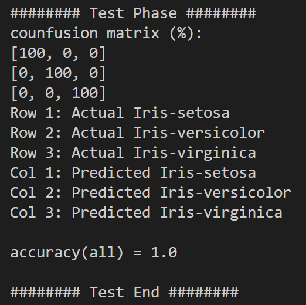

# iris-classifier
Author: Keren Zhou  
Date: From 2020-12-12 to 2020-12-14  
Summary: An artificial neuro network (ANN) to classify an Iris sample into Setosa, Versicolour or Virginica， a course project for comp131 at Tufts University.  
概述：将鸢尾花样本分类为Setosa、Versicolour或Virginica的神经网络,塔夫茨大学comp131课程的课程项目。  

 

## How to use
Environment: Python 3.6 or higher.  

Usage: python main.py [data_set]  
For example, python main.py "ANN - Iris data.txt"  

* data_set: File that contains data set.  
    Data for each example takes one line as follows:  
    &lt;sepal_length&gt;,&lt;sepal_width&gt;,&lt;petal_length&gt;,&lt;petal-width&gt;,&lt;type&gt;  
    Length and width are in cm.   
    Type is one of Iris-setosa, Iris-versicolor and Iris-virginica.  
* If data_set is not provided, this program will use "ANN - Iris data.txt" as the default example data file.
* The program first trains the artificial neural network with the data set. During training, it prints out number of rounds that the ANN has been trained and computes the mean square error with a validation set.  
  
* After training, the program tests the ANN with a test set and reports its confusion matrix and accuracy.  
  
* After test, user can input examples to classify. For each example, user needs to input sepal length, sepal width, petal length and petal width in cm according to the instruction. Then, it will report the Iris type as result. User can stop by input any negative value.  
  

## 使用方法
环境：Python 3.8 或更高。  

用法：python main.py [data_set]  
例如，python main.py "ANN - Iris data.txt"  

* data_set: 数据集文件。  
每一个样本的数据占一行，格式如下：  
&lt;sepal_length&gt;,&lt;sepal_width&gt;,&lt;petal_length&gt;,&lt;petal-width&gt;,&lt;type&gt;  
长度和宽度以cm为单位。
* 如果data_set为空，则默认使用"ANN - Iris data.txt"作为样本数据文件。
* 该程序会先利用训练集训练神经网络。训练过程中会输出当前训练次数，并用验证集计算当前神经网络分类结果的平均方差。  
  
* 训练完成后，该程序会用测试集计算混淆矩阵和准确度。  
  
* 完成测试后，用户可以输入样本进行分类。对于每个样本，用户需要根据提示输入花萼长度、花萼宽度、花瓣长度和花瓣宽度（cm）。然后，它会返回鸢尾花样本的类型。若想终止程序，输入任意负值即可。  
  

 

## Files
* spec.pdf: Assignment specification for comp131 at Tufts University, which is related to this project.
* src: Python source codes and data sets for this project. You can run this project under this directory.

## 文件说明
* spec.pdf: 与该项目相关的塔夫茨大学comp131课程的作业要求。
* src: 该项目的Python源码和数据集。可以在该路径下运行该项目。
